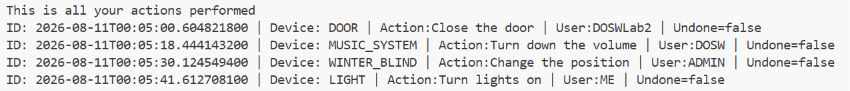
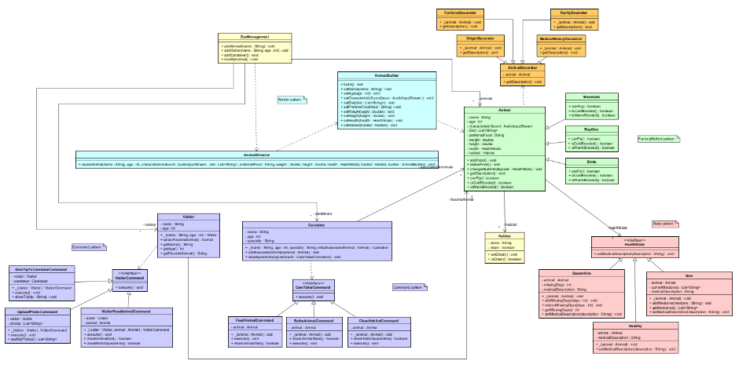

# DOSW_Lab2_Moreno_Pachon_Novoa

## SOLID Principles, Design Patterns, UML Class Diagrams, and Advanced Object-Oriented Programming

> _**Course:**_ DOSW — Software Development and Operations   
> _**Institution:**_ Escuela Colombiana de Ingeniería Julio  
> _**Group:**_ 4  
> _**Teacher:**_ Rodrigo Humberto Gualtero Martinez

| Name | Institutional Email | GitHub Username | GitHub Email|
|---|---|---|---| 
| Jeronimo Moreno Herrera | jeronimo.moreno-h@mail.escuelaing.edu.co | Dracodec113 | jeronimo.moreno-h@mail.escuelaing.edu.co |
| Paula Alejandra Novoa Castellanos | paula.novoa-c@mail.escuelaing.edu.co | Aleja15-31 | paula.novoa-c@mail.escuelaing.edu.co |
| Derly Valeria Pachón Pinzón | derly.pachon-p@mail.escuelaing.edu.co | itsValePp | dv.pachonpinzon@gmail.com |

---

# Challenges

## Challenge 1 — Don Pepe's Store

### Technical Explanation

- How each SOLID principle is applied.
- How polymorphism is applied.
- How encapsulation is applied.
- How immutability is guaranteed for product prices.
- Which Stream operations are used, such as:
  - `map`
  - `filter`
  - `reduce`
  - `forEach`

### Design Documentation

#### SOLID Principles

| Principle | Application in the Solution |
|---|---|
| Single Responsibility | We abided to this principle by creating multiple independent classes that solved a single part of the problem, or multiple closely associated problems. This can be seen clearly in the `ShoopingCart` class for example, this class manages products, subtotal and checkout. Each one of those is clearly associated thus keeping the principle.|
| Open/Closed | We can easily extend our code. If a new customer is required we can easily build it using the `DiscountStrategy` interface. We wouldn't need to modify existing classes.|
| Liskov Substitution | Every implementation of `DiscountStrategy` can easily substitue each other without altering `ShoppingCart` |
| Interface Segregation | `DiscountStrategy` has a single method, no concrete class is implementing things that it doesn't need.|
| Dependency Inversion | `ShoppingCart` is tied with `DiscountStrategy`, not a concrete class. Then we use `DiscountFactory` to build it, thus giving the responsibility to a class outside of `ShoppingCart`.  |

#### Polymorphism

`DiscountStrategy` defines a contract `applyDiscount`. `ShoppingCart` then calls that method without knowing what type of client it is at first, then the client is chosen during execution and the correct object is returned.

#### Encapsulation and Immutability

We experimented with `records`. Thus `Product` and `CartItem` automatically generates encapsulated attributes, then each attribute that's needed has its own getter and/or setter. `ShoppingCart` for example is only exposed through controlled methods.

### Evidence


---

## Challenge 2 — The Five-Star Chef

### Design Pattern Documentation

| Item | Team Explanation |
|---|---|
| Design Pattern Category | Creational |
| Pattern Used | Builder |
| Justification | The Builder pattern is appropriate because a hamburger can have many different combinations of ingredients. Instead of using a large constructor with many parameters, the hamburger can be created step by step, adding only the ingredients selected by the user. |
| How It Was Applied | A HamburgerBuilder is used to construct the hamburger progressively. The user can select different ingredients such as bread, meat, chicken, cheese, and sauces. Each option is added to the builder, and when the process is finished, the builder creates the final customized Hamburger object. |

### Evidence

- Final customized hamburger generated


- Test execution showing that the hamburger builder functionality works correctly.


---

## Challenge 3 — The Kingdom of Vehicles

### Design Pattern Documentation

| Item | Team Explanation |
|---|---|
| Design Pattern Category | Creational |
| Pattern Used | Builder |
| Justification | The Builder pattern is appropriate because a vehicle can have several characteristics, such as its family, category, price, speed, comfort, and equipment. Creating a vehicle with all these attributes directly could make the construction process complex and difficult to maintain. Builder allows the vehicle to be constructed step by step according to the required configuration. |
| How It Was Applied | The VehicleBuilder is responsible for progressively configuring and creating a Vehicle object. The VehicleDirector defines the construction process for specific types of vehicles by determining which steps should be performed. This separates the construction logic from the final vehicle object and makes it easier to create different vehicle configurations. |

### Evidence


---

## Challenge 4 — The Currency Exchange Scam

### Design Pattern Documentation

| Item | Team Explanation |
|---|---|
| Design Pattern Category | Behavioral |
| Pattern Used | Strategy |
| Justification | We saw that we had to do multiple similar calculations to calculate the exchange rate. We thought that this looked similar to the strategy design pattern. We had multiple exchange rates, we only needed to choose one. |
| How It Was Applied | Basically `ExchangeRate` is our interface and `ExchangeRateMap` is our concrete strategy. Finally, through `CurrencyConverter` (the context), the strategy is received and the concrete implementation is never revealed. |

### Evidence


### Important Note

Document how exchange rates are represented and supplied to the conversion service. The implementation must not apply one shared rate to all currency pairs.

Each pair of currencies is added individually to the `Map`.

---

## Challenge 5 — Customized Coffee

### Design Pattern Documentation

| Item | Team Explanation |
|---|---|
| Design Pattern Category | Structural |
| Pattern Used | Decorator |
| Justification | The Decorator pattern is appropriate because the system must allow customers to add different ingredients to a basic coffee without modifying the original coffee class. It also allows several ingredients to be combined dynamically, with each ingredient adding its own description and cost.|
| How It Was Applied | A Coffee interface defines the common behavior of all coffees and decorators. BasicCoffee represents the original coffee, while CoffeeDecorator provides the base structure for additional ingredients. Specific decorators such as MilkDecorator, ChocolateDecorator, CaramelDecorator, CreamDecorator, MintDecorator, and CustomIngredientDecorator wrap a coffee and add their own description and price. This allows several decorators to be combined to create a customized coffee. |

### Evidence


---

## Challenge 6 — Talk to Technical Support

### Design Pattern Documentation

| Item | Team Explanation |
|---|---|
| Design Pattern Category | Behavioral |
| Pattern Used | Chain of Responsibility |
| Justification | Each ticket has to pass through multiple technicians in order to find the correct one, the code doesn't need to know the order in which te tickets are thrown nor the quantity of available technicians. Chain of responsibility is meant to be used in these cases. |
| How It Was Applied | `TechnicianHandler` is an abstract class that has the template method `handle(ticket)` and `canHandle(ticket)`. `Technician` is the only concrete class, each technician has its `maxPriority` to be able to create the corresponding chain through `setNext()`. Finally `SupportSystem` sets up the chain and goes through each ticket. |

### Expected Summary

The output should identify:

- Which technician handled each ticket.
- Which tickets moved through more than one technician.
- Which tickets remained unresolved.
- Resolution statistics.

### Evidence


---

## Challenge 7 — The Magic Remote Control

### Design Pattern Documentation

### Design Pattern Documentation

| Item | Team Explanation |
|---|---|
| Design Pattern Category | Behavioral |
| Pattern Used | Command |
| Justification | The remote control needs to handle different actions for different devices (door, light, music, blind) without knowing the details of each device, and it also needs to support undo actions and keep a history of what was executed. The Command pattern divides the invoker (`RemoteControl`) from the receivers (`Door`, `Light`, `MusicSystem`, `WindowBlind`), letting each action be treated as an object that can be executed, saved, and undone. |
| How It Was Applied | The `Command` interface defines the contract (`execute()`, `setPastState()`, `getName()`, `getDeviceInvolved()`). Each device has a concrete command class (`DoorCommandAction`, `LightCommandAction`, `MusicSystCommandAction`, `BlindCommandAction`) that implements this interface and holds a reference to its receiver (the device). `RemoteControl` acts as the invoker: it calls `execute()` on any `Command` it receives without knowing its concrete type, logs it in a `History` list, and can call `setPastState()` on a past command to undo it. `Challenge7MagicRemoteControl` acts as the client, creating the receivers and command objects and passing them to the invoker. |

### Audit Evidence

The final output should make it possible to answer:

- Who executed each action? => yes
- Which actions were undone? => yes
- Which user changed each device? => yes
- What is the complete execution history? => yes



---

## Challenge 8 — The UML Zoo

#### Main Classes and Responsibilities

| Class or Interface | Responsibility |
|---|---|
| **ZooManagement** | Central class responsible for registering animals, visitors, caretakers, and modifying animal data. |
| **Animal** | Abstract base class representing an animal in the zoo with its characteristics(name, age, diet, health status, habitat) and general behaviors. |
| **Mammals / Reptiles / Birds** | Concrete implementations of `Animal` representing specific classes with specialized traits |
| **AnimalBuilder / AnimalDirector** | Construct complex `Animal` instances step-by-step with specified properties. |
| **AnimalDecorator** | Abstract base decorator class that allows addition of features to an `Animal` instance without modifying its structure. |
| **FurColorDecorator / OriginDecorator / RarityDecorator / MedicalHistoryDecorator** | Concrete decorators that attach extra properties (e.g., fur color, origin, rarity, medical history) to an `Animal`. |
| **Caretaker** | Represents zoo staff members and execution of caretaking activities via commands. |
| **Visitor** | Represents visitors who can select favorite animals and execute visitor interactions using command objects. |
| **CareTakerCommand** | Interface defining the `execute()` contract for caretaker tasks (feeding, bathing, cleaning habitat). |
| **FeedAnimalCommand / BatheAnimalCommand / CleanHabitatCommand** | Concrete command implementations of caretaker actions on animals or habitats. |
| **VisitorCommand** | Interface defining the `execute()` contract for visitor interactions. |
| **GiveTipToCaretakerCommand / UploadPhotoCommand / VisitorFeedAnimalCommand** | Concrete command implementations of visitor interactions with caretakers or animals. |
| **HealthState** | State interface defining operations related to modifying an animal's medical description. |
| **Healthy / Sick / Quarantine** | Concrete state implementations representing the health condition of an animal and defining state-specific behavior. |
| **Habitat** | Represents the physical habitat associated with animals, including clean state and description. |

#### Relationships

| Source | Relationship | Target | Multiplicity | Explanation |
|---|---|---|---|---|
| **Mammals** | Inheritance | **Animal** | 1..1 | `Mammals` extends the base abstract class `Animal`. |
| **Reptiles** | Inheritance | **Animal** | 1..1 | `Reptiles` extends the base abstract class `Animal`. |
| **Birds** | Inheritance | **Animal** | 1..1 | `Birds` extends the base abstract class `Animal`. |
| **AnimalDecorator** | Inheritance & Association | **Animal** | 1..1 (Target) | `AnimalDecorator` extends `Animal` and holds a wrapped `Animal` reference to apply dynamic attributes. |
| **FurColorDecorator / OriginDecorator / RarityDecorator / MedicalHistoryDecorator** | Inheritance | **AnimalDecorator** | 1..1 | Concrete decorators extending `AnimalDecorator`. |
| **Caretaker** | Association | **Animal** | 0..* | A `Caretaker` is associated with one or more `Animal` instances (`- assignedAnimals`). |
| **Visitor** | Association | **Animal** | 0..* | A `Visitor` can select multiple `Animal` instances as favorites (`- favoriteAnimals`). |
| **ZooManagement** | Association | **Visitor** | 0..* | `ZooManagement` maintains a collection of registered visitors (`- visitors`). |
| **ZooManagement** | Association | **Caretaker** | 0..* | `ZooManagement` maintains a collection of registered caretakers (`- caretakers`). |
| **ZooManagement** | Association | **Animal** | 0..* | `ZooManagement` manages the list of animals (`- animals`). |
| **Animal** | Association | **Habitat** | 1..1 | Each `Animal` belongs to a specific `Habitat`. |
| **Animal** | Association | **HealthState** | 1..1 | An `Animal` maintains a reference to its current `HealthState`. |
| **Healthy / Sick / Quarantine** | Realization | **HealthState** | 1..1 | Concrete implementations of the `HealthState` interface. |
| **FeedAnimalCommand / BatheAnimalCommand / CleanHabitatCommand** | Realization | **CareTakerCommand** | 1..1 | Concrete caretaker commands implementing the `CareTakerCommand` interface. |
| **GiveTipToCaretakerCommand / UploadPhotoCommand / VisitorFeedAnimalCommand** | Realization | **VisitorCommand** | 1..1 | Concrete visitor commands implementing the `VisitorCommand` interface. |

#### SOLID Application

| Principle | Application in the UML Design |
|---|---|
| **Single Responsibility** | Actions are split into distinct classes: each command do something, each type of animal is different, etc... |
| **Open/Closed** | New animal dynamic attributes can be added via new `AnimalDecorator` subclasses, new actions via new `CareTakerCommand`/`VisitorCommand` classes, or new states via `HealthState` without altering existing code. |
| **Liskov Substitution** | Any subclass of `Animal` (`Mammals`, `Reptiles`, `Birds`) or any wrapped `AnimalDecorator` can be passed seamlessly wherever an `Animal` instance is needed. |
| **Interface Segregation** | Commands and actions are decoupled into specific interfaces (`CareTakerCommand`, `VisitorCommand`, `HealthState`) containing only methods relevant to their implementations. |
| **Dependency Inversion** | Controllers (`ZooManagement`, `Caretaker`, `Visitor`) depend on abstractions (`Animal`, `HealthState`, `CareTakerCommand`, `VisitorCommand`) rather than concrete implementations. |

#### Design Patterns

| Item | Team Explanation |
|---|---|
| **Design Pattern Category** | Structural / Behavioral / Creational |
| **Pattern Used** | Decorator, Command, State, Builder, Factory Method |
| **Justification** | The requirements demand dynamic attributes (fur color, origin, rarity, medical history), state-dependent behaviors (health status), encapsulate action invocations (caretaker/visitor actions), and flexible animal creation. |
| **How It Was Applied** | **1. Decorator:** `AnimalDecorator` and its subclasses dynamically create `Animal` objects to attach dynamic attributes.<br>**2. Command:** `CareTakerCommand` and `VisitorCommand` develop actions into executable command objects.<br>**3. State:** `HealthState` (`Healthy`, `Sick`, `Quarantine`) create health-based behavior transitions for `Animal`.<br>**4. Builder & Factory Method:** `AnimalBuilder` / `AnimalDirector` build  animal objects step-by-step, and `Mammals`/`Reptiles`/`Birds` instantiate concrete animal types. |

#### Diagram

Add the UML diagram below:



# Repository Evidence

## Branching Strategy

Describe the branches used by the team:

```text
  remotes/origin/main

  remotes/origin/documentation --- Branch used to finish the README.md
  |_ remotes/origin/documentation_MorenoJeronimo -- Individual Branch used by Jeronimo.
  
  remotes/origin/develop --- Stable release development branch
  
  -- The structure is the same for each challenge. A main branch, then individual branches for simultaneous workflow.--

  remotes/origin/feature/challenge1
  |_ remotes/origin/feature/challenge1_MorenoJeronimo
  |_ remotes/origin/feature/challenge_1_paulaNovoa

  remotes/origin/feature/challenge_2
  |_ remotes/origin/feature/challenge_2_MorenoJeronimo
  |_ remotes/origin/feature/challenge_2_paulaNovoa

  remotes/origin/feature/challenge_3
  |_ remotes/origin/feature/challenge_3_DerlyPachon
  |_ remotes/origin/feature/challenge3_paulaNovoa


  remotes/origin/feature/challenge_4
  |_remotes/origin/feature/challenge_4_MorenoJeronimo

  remotes/origin/feature/challenge_5
  |_remotes/origin/feature/challenge_5_DerlyPachon
  |_remotes/origin/feature/challenge_5_MorenoJeronimo
  |_remotes/origin/feature/challenge_5_paula-novoa

  remotes/origin/feature/challenge_6
  |_remotes/origin/feature/challenge_6_MorenoJeronimo
  |_remotes/origin/feature/challenge_6_paulaNovoa

  remotes/origin/feature/challenge_7
  |_remotes/origin/feature/challenge_7_DerlyPachon

  remotes/origin/feature/challenge_8
  
```
