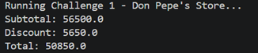
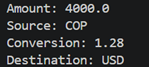
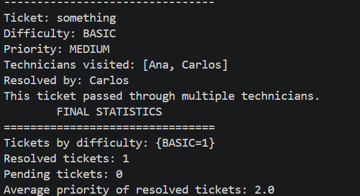

# DOSW_Lab2_Moreno_Pachon_Novoa

## SOLID Principles, Design Patterns, UML Class Diagrams, and Advanced Object-Oriented Programming

> _**Course:**_ DOSW — Software Development and Operations   
> _**Institution:**_ Escuela Colombiana de Ingeniería Julio  
> _**Group:**_ 4  
> _**Teacher:**_ Rodrigo Humberto Gualtero Martinez

| Name | Institutional Email | GitHub Username | GitHub Email|
|---|---|---|---| 
| Jeronimo Moreno Herrera | jeronimo.moreno-h@mail.escuelaing.edu.co | Dracodec113 | jeronimo.moreno-h@mail.escuelaing.edu.co |
| Paula Alejandra Novoa Castellanos | paula.novoa-c@mail.escuelaing.edu.co | Aleja15-31 | paula.novoa-c@mail.escuelaing.edu.co |
| Derly Valeria Pachón Pinzón | derly.pachon-p@mail.escuelaing.edu.co | itsValePp | dv.pachonpinzon@gmail.com |

---

# Challenges

## Challenge 1 — Don Pepe's Store

### Technical Explanation

- How each SOLID principle is applied.
- How polymorphism is applied.
- How encapsulation is applied.
- How immutability is guaranteed for product prices.
- Which Stream operations are used, such as:
  - `map`
  - `filter`
  - `reduce`
  - `forEach`

### Design Documentation

#### SOLID Principles

| Principle | Application in the Solution |
|---|---|
| Single Responsibility | We abided to this principle by creating multiple independent classes that solved a single part of the problem, or multiple closely associated problems. This can be seen clearly in the `ShoopingCart` class for example, this class manages products, subtotal and checkout. Each one of those is clearly associated thus keeping the principle.|
| Open/Closed | We can easily extend our code. If a new customer is required we can easily build it using the `DiscountStrategy` interface. We wouldn't need to modify existing classes.|
| Liskov Substitution | Every implementation of `DiscountStrategy` can easily substitue each other without altering `ShoppingCart` |
| Interface Segregation | `DiscountStrategy` has a single method, no concrete class is implementing things that it doesn't need.|
| Dependency Inversion | `ShoppingCart` is tied with `DiscountStrategy`, not a concrete class. Then we use `DiscountFactory` to build it, thus giving the responsibility to a class outside of `ShoppingCart`.  |

#### Polymorphism

`DiscountStrategy` defines a contract `applyDiscount`. `ShoppingCart` then calls that method without knowing what type of client it is at first, then the client is chosen during execution and the correct object is returned.

#### Encapsulation and Immutability

We experimented with `records`. Thus `Product` and `CartItem` automatically generates encapsulated attributes, then each attribute that's needed has its own getter and/or setter. `ShoppingCart` for example is only exposed through controlled methods.

### Evidence



---

## Challenge 2 — The Five-Star Chef

### Design Pattern Documentation

| Item | Team Explanation |
|---|---|
| Design Pattern Category | TODO |
| Pattern Used | TODO |
| Justification | TODO |
| How It Was Applied | TODO |

### Evidence

- Screenshot or console output showing user selections.


- Screenshot or console output showing the final hamburger.


- Relevant tests.
- UML or class relationship diagram, when applicable.

---

## Challenge 3 — The Kingdom of Vehicles

### Design Pattern Documentation

| Item | Team Explanation |
|---|---|
| Design Pattern Category | TODO |
| Pattern Used | TODO |
| Justification | TODO |
| How It Was Applied | TODO |

### Evidence


---

## Challenge 4 — The Currency Exchange Scam

### Design Pattern Documentation

| Item | Team Explanation |
|---|---|
| Design Pattern Category | Behavioral |
| Pattern Used | Strategy |
| Justification | We saw that we had to do multiple similar calculations to calculate the exchange rate. We thought that this looked similar to the strategy design pattern. We had multiple exchange rates, we only needed to choose one. |
| How It Was Applied | Basically `ExchangeRate` is our interface and `ExchangeRateMap` is our concrete strategy. Finally, through `CurrencyConverter` (the context), the strategy is received and the concrete implementation is never revealed. |

### Evidence



### Important Note

Document how exchange rates are represented and supplied to the conversion service. The implementation must not apply one shared rate to all currency pairs.

Each pair of currencies is added individually to the `Map`.

---

## Challenge 5 — Customized Coffee

### Design Pattern Documentation

| Item | Team Explanation |
|---|---|
| Design Pattern Category | TODO |
| Pattern Used | TODO |
| Justification | TODO |
| How It Was Applied | TODO |

### Evidence


---

## Challenge 6 — Talk to Technical Support

### Design Pattern Documentation

| Item | Team Explanation |
|---|---|
| Design Pattern Category | Behavioral |
| Pattern Used | Chain of Responsibility |
| Justification | Each ticket has to pass through multiple technicians in order to find the correct one, the code doesn't need to know the order in which te tickets are thrown nor the quantity of available technicians. Chain of responsibility is meant to be used in these cases. |
| How It Was Applied | `TechnicianHandler` is an abstract class that has the template method `handle(ticket)` and `canHandle(ticket)`. `Technician` is the only concrete class, each technician has its `maxPriority` to be able to create the corresponding chain through `setNext()`. Finally `SupportSystem` sets up the chain and goes through each ticket. |

### Expected Summary

The output should identify:

- Which technician handled each ticket.
- Which tickets moved through more than one technician.
- Which tickets remained unresolved.
- Resolution statistics.

### Evidence



---

## Challenge 7 — The Magic Remote Control

### Design Pattern Documentation

| Item | Team Explanation |
|---|---|
| Design Pattern Category | TODO |
| Pattern Used | TODO |
| Justification | TODO |
| How It Was Applied | TODO |

### Audit Evidence

The final output should make it possible to answer:

- Who executed each action?
- Which actions were undone?
- Which user changed each device?
- What is the complete execution history?


---

## Challenge 8 — The UML Zoo

#### Main Classes and Responsibilities

| Class or Interface | Responsibility |
|---|---|
| TODO | TODO |

#### Relationships

| Source | Relationship | Target | Multiplicity | Explanation |
|---|---|---|---|---|
| TODO | TODO | TODO | TODO | TODO |

#### SOLID Application

| Principle | Application in the UML Design |
|---|---|
| Single Responsibility | TODO |
| Open/Closed | TODO |
| Liskov Substitution | TODO |
| Interface Segregation | TODO |
| Dependency Inversion | TODO |

#### Design Patterns

| Item | Team Explanation |
|---|---|
| Design Pattern Category | TODO or Not Used |
| Pattern Used | TODO or Not Used |
| Justification | TODO |
| How It Was Applied | TODO |

#### Diagram

Add the UML diagram below:

```markdown

```

#### Evidence


# Repository Evidence

## Branching Strategy

Describe the branches used by the team:

```text
  remotes/origin/main

  remotes/origin/documentation --- Branch used to finish the README.md
  |_ remotes/origin/documentation_MorenoJeronimo -- Individual Branch used by Jeronimo.
  
  remotes/origin/develop --- Stable release development branch
  
  -- The structure is the same for each challenge. A main branch, then individual branches for simultaneous workflow.--

  remotes/origin/feature/challenge1
  |_ remotes/origin/feature/challenge1_MorenoJeronimo
  |_ remotes/origin/feature/challenge_1_paulaNovoa

  remotes/origin/feature/challenge_2
  |_ remotes/origin/feature/challenge_2_MorenoJeronimo
  |_ remotes/origin/feature/challenge_2_paulaNovoa

  remotes/origin/feature/challenge_3
  |_ remotes/origin/feature/challenge_3_DerlyPachon
  |_ remotes/origin/feature/challenge3_paulaNovoa


  remotes/origin/feature/challenge_4
  |_remotes/origin/feature/challenge_4_MorenoJeronimo

  remotes/origin/feature/challenge_5
  |_remotes/origin/feature/challenge_5_DerlyPachon
  |_remotes/origin/feature/challenge_5_MorenoJeronimo
  |_remotes/origin/feature/challenge_5_paula-novoa

  remotes/origin/feature/challenge_6
  |_remotes/origin/feature/challenge_6_MorenoJeronimo
  |_remotes/origin/feature/challenge_6_paulaNovoa

  remotes/origin/feature/challenge_7
  |_remotes/origin/feature/challenge_7_DerlyPachon

  remotes/origin/feature/challenge_8
  
```